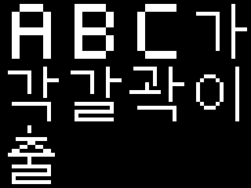
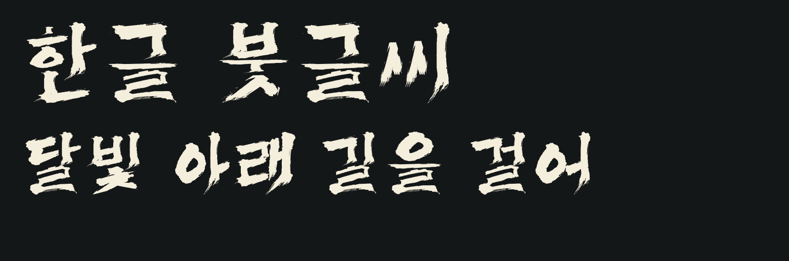
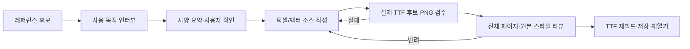

# make-font-with-ai

**레퍼런스를 고르고, 사용처를 묻고, 실제 글리프를 검수한 뒤 파일까지 만드는 AI 폰트 제작 플러그인.**

[English](README.en.md) · [설치](docs/INSTALL.md) · [인터뷰](docs/USE_CASE_INTERVIEW.md) · [제작 가이드](docs/WORKFLOW.md) · [검수 게이트](docs/QUALITY_GATES.md) · [라이선스](docs/LICENSING.md)

> **비상업용 소스 공개 프로젝트입니다.** PolyForm Noncommercial 1.0.0을 적용합니다. 상업 이용을 제한하므로 OSI 정의의 오픈소스라고 부르지 않습니다. 라이선스 원문은 [LICENSE](LICENSE), 범위와 산출물 권리는 [LICENSING](docs/LICENSING.md)을 확인하세요.

## 같은 레퍼런스라도 사용처가 다르면 제작이 달라집니다

| 16×16 레트로 게임 대사 | 큰 붓글씨 제목 |
|---|---|
| 네이티브 픽셀 격자에서 설계 | 압력·곡선·끝획을 가진 벡터 윤곽 |
| 실제 1배율 판독, 고정 셀·기준선 | 실제 사용 크기의 밀도·광학 중심·자모 배치 |
| TTF의 픽셀이 원본 격자와 일치해야 함 | ㄱ 꺾임·ㅐ 연결·ㄹ의 교대 꺾임과 붓결을 함께 검수 |
| 엔진이 요구하면 PNG atlas + 문자 매핑 | 렌더링·리뷰를 통과한 TTF |



위 예제는 프로젝트에서 직접 그린 **10자 픽셀 테스트 집합**입니다. 2,350자 픽셀 한글 완성본이 아닙니다. 확대 그림만 합격시키지 않고 실제 16px와 32px 출력을 원래 픽셀 배열과 비교합니다.



이 붓글씨 경로에는 앞선 R36 프로젝트의 자체 윤곽·문맥형·배치 엔진과 회귀 게이트를 이식했습니다. **특정 한글 붓글씨 계열의 출발점이지, 어떤 이미지든 넣으면 같은 품질의 11,172자가 자동 생성되는 모델은 아닙니다.** 다른 레퍼런스는 AI가 새 소스/원형을 작성하고 실제 출력을 다시 검토해야 합니다.

## 실제 들어 있는 것

- **Claude Code 플러그인 + 독립 Agent Skills**: `skills/make-font/SKILL.md`와 `.claude-plugin` 매니페스트.
- **2단계 시작의 필수 인터뷰**: 목적, 역할, 표시 크기, 엔진, 문자 범위, 인코딩, 기준선·행간, 출력 형식. 확정된 `design-brief.json`에만 구현을 허용합니다.
- **Python CLI `mfai`**: 네이티브 비트맵 JSON, 벡터 경로/폴리곤 JSON, R36 한글 템플릿을 실제 TTF 후보로 빌드합니다.
- **명시적 이미지 매핑**: `import-atlas`는 고정 격자 이미지를 그대로 가져오고, `trace-glyph`는 사용자가 지정한 한 글자 영역을 벡터 후보로 추적합니다. OCR로 문자 정체성을 추측하지 않습니다.
- **리뷰와 빌드 분리**: 후보와 실제 PNG를 먼저 만들고, 기술 검사·전체 페이지·원본 스타일·원래 크기의 판독성 리뷰가 승인된 다음 최종 파일을 저장하고 다시 읽습니다.
- **크로스플랫폼 CI**: Windows, macOS, Linux에서 테스트와 실제 빌드를 실행하는 워크플로. 설정 여부와 실행 성공 여부는 구분합니다. 현재 실행 상태는 저장소의 Actions를 보세요.

**기본 API 키, 유료 모델, 이미지 생성 서비스, 자동 외부 업로드는 없습니다.** 레퍼런스 생성은 사용 중인 AI 호스트가 제공하는 이미지 도구를 사용하거나 이미지를 직접 제공합니다. 이 저장소가 이미지 모델을 자체 호스팅하는 것은 아닙니다.

## 설치

```sh
git clone https://github.com/yazzang-homelab/make-font-with-ai.git
cd make-font-with-ai
python -m venv .venv
# Linux/macOS: source .venv/bin/activate
# Windows PowerShell: .venv\Scripts\Activate.ps1
python -m pip install -e ".[brush,trace]"
mfai doctor
```

Python 3.11 이상을 사용합니다. 플러그인을 설치해도 Python 의존성은 자동 설치되지 않습니다.

### Claude Code

저장소 루트를 로컬 플러그인으로 바로 로드할 수 있습니다.

```sh
claude --plugin-dir .
```

또는 Claude Code 안에서:

```text
/plugin marketplace add yazzang-homelab/make-font-with-ai
/plugin install make-font-with-ai@make-font-with-ai
/make-font-with-ai:make-font
```

다른 Agent Skills 호스트에서는 해당 `SKILL.md`를 사용하고 CLI를 실행할 터미널/파일 접근 권한을 연결합니다. **ChatGPT 웹에 직접 설치되는 호스팅 MCP 앱으로 제공되는 것은 아닙니다.**

## 한 프로젝트의 완전한 흐름



```sh
mfai init my-font --kind bitmap --cell 16
# reference.png를 준비하고, 인터뷰를 통해 design-brief.json을 채웁니다.
mfai check-brief my-font
mfai confirm-brief my-font --by "사용자 확인 기록"
# 실제 glyphs.json을 작성하거나, 사양과 일치하는 atlas를 가져옵니다.
mfai import-atlas my-font my-font/reference.png --columns 4
mfai snapshot my-font --label before-first-candidate
mfai prepare my-font
```

`prepare`는 **실제 후보 TTF를 저장**하고 그것을 읽어 검수 PNG를 만듭니다. 출처가 없는 모양이나 필요한 문자를 대신 지어내지 않습니다. 기술 검수에 실패해도 후보는 교정용으로 남지만 최종 빌드는 차단합니다.

화면에 나온 `.../proofs/index.html`을 열고 **모든 글자와 문장·원래 표시 크기**를 확인한 후에만:

```sh
mfai review my-font --reviewer "검토자" --reviewer-type human --notes "실제로 확인한 범위와 판단" --accept --all-pages --reference-match --native-readable
mfai build my-font
```

AI가 검토했다면 `--reviewer-type ai`를 사용합니다. 사람 검토로 꾸미지 않습니다. 리포트는 명시적 확인 기록이며 강제 인증이나 미감 보증이 아닙니다.

최종 출력은 `my-font/output/<family>-Regular.ttf`, `build-receipt.json`, 선택한 경우 `atlas/atlas-*.png`와 `atlas.json`입니다. **코드 0만 보고 성공했다고 하지 않고, 실제 파일을 저장하고 다시 읽어 동일성을 확인합니다.**

## 예제

| 폴더 | 범위 | 확인 사항 |
|---|---|---|
| `examples/pixel16` | 10자, 16×16 원본 격자 | 실제 1×/2× 픽셀 일치, 16px 고정폭, PNG atlas |
| `examples/vector` | SVG 곡선 기반 ABC | 벡터 입력, 구멍·윤곽, 실제 32/128px 출력 |
| `examples/hangul-brush` | R36 엔진; 2,350자 검수 집합 | 전용 ㄹ·ㄱ/ㅋ·배치·가려짐 게이트, 실제 한글 문장 |

예제는 사양·소스 데이터이며 **시각 승인 파일이나 TTF를 포함하지 않습니다.** 사용자가 목적을 확인하고 직접 출력물을 검토해야 합니다. R36 출력에는 현대 한글 11,172자가 들어가지만, 예제의 일반 PNG 리뷰 범위는 2,350자입니다. 나머지를 자동으로 시각 승인한 것으로 기록하지 않습니다.

## 실패를 숨기지 않는 게이트

사양 미확정, 레퍼런스 교체, 누락 문자, 잘못된 폭, 실제 클리핑, 동일 비트맵 중복, 1× 픽셀 불일치, NFC/NFD 차이, 변경된 PNG, 오래된 리뷰, 문자열 `"true"`, 다른 후보의 보고서, 기존 다른 파일 덮어쓰기를 차단합니다.

**파일 전체 SHA가 다르다고 무조건 실패시키지 않습니다.** 시각·배치를 결정하는 좌표와 점 플래그, 문자 매핑, 폭·좌측 여백, 조합 테이블을 정확히 비교합니다. 테이블 저장 위치나 시각 정보만 달라지는 경우와 실제 한 좌표가 바뀐 경우를 구분합니다. 오차 허용치를 높이거나 새 해시를 그냥 허용 목록에 넣지 않습니다.

## 지원 범위의 경계

현재는 정적 TTF 및 PNG atlas+Unicode 매핑을 지원합니다. 픽셀 TTF는 **격자에 맞춘 윤곽 TTF**이며 EBDT/CBLC 같은 내장 비트맵 테이블을 생성하는 것은 아닙니다. 대상 게임이 자체 렌더링으로 평활화한다면 atlas 또는 엔진 설정을 검증해야 합니다.

가변 폰트, 컬러 TTF, OTF/CFF, BDF/FON, 자동 옛한글 조합, Shift-JIS 등 레거시 바이트 인코딩 출력은 지원하지 않습니다. 하이브리드는 각각 승인하는 비트맵·벡터 두 프로젝트로 처리합니다. 숫자 합격이 원본 붓글씨의 미적 재현을 보장하지 않습니다.

[문제 해결](docs/TROUBLESHOOTING.md) · [보안과 데이터](SECURITY.md) · [기여](CONTRIBUTING.md) · [변경 기록](CHANGELOG.md)
